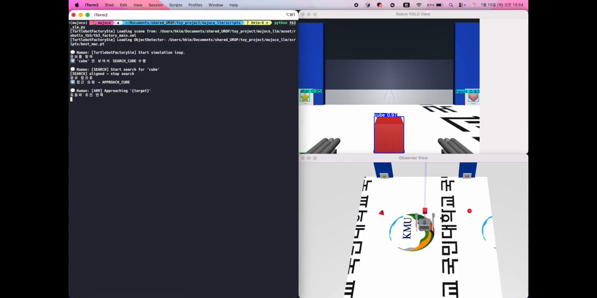
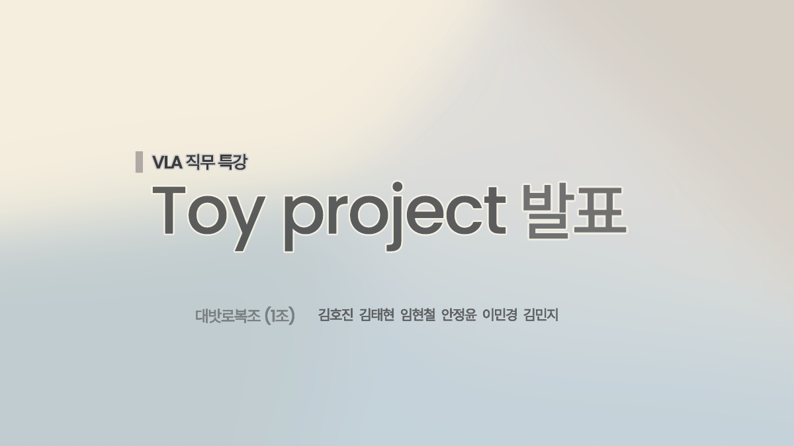

# toy_project
## 약 2주 동안 진행한 프로젝트  

### 실습 코드를 변형
- 버거 --> 와플 (물체를 잡을 수 있는 집게 발 장착)  
- 별, 하트, 정사면체, 정육면체, 구를 인식하도록 YOLO 학습  
- `정사면체, 정육면체, 구`는 운반해야 할 물체, `별, 하트`는 운반해야 할 장소  
- LLM 모델은 API 하루 할당량 문제로 ollama로 변경하여 사용

### 데모 영상

> 썸네일을 클릭하면 GitHub 영상 플레이어에서 [demo.mp4](demo.mp4)가 재생됩니다.

### 발표 자료

> 이미지를 클릭하면 [presentation.pdf](presentation.pdf) 전체를 GitHub PDF 뷰어로 볼 수 있습니다.